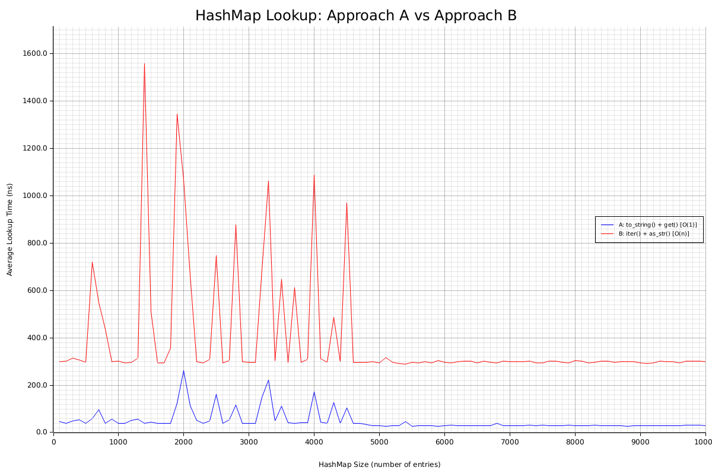

Given a `HashMap<(String, String), u32>`

When providing with `(&str, &str)`, find out the u32 data.

There are two approaches:

A: Use `str.to_string()` to convert `(&str, &str)` to `(String, String)`,
   use `HashMap::get()`.

B: Use `HashMap::iter()` and `String::as_str()` for search.

Approach A need to heap allocation for converting `&str` to `String` but
quicker on HashMap `O(1)` get access.

Approach B is `O(N)` but require no heap allocation.

This project is created to prove which one is better(performance).

TODO: memory usage should also be benchmarked.
